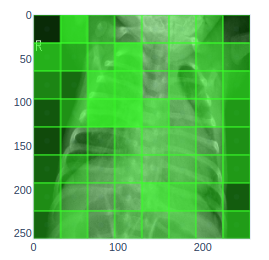

# rad-cam
A more radical and general CNN activation viewer

Radcam utilizes plotly figures to create a heatmap
of important image features with hover-over predictions
for each class. (Currently only for pytorch)

Special Thanks to [@seantur](https://github.com/seantur)


### Install
Clone repo and install:
  python setup.py install

### Usage
[Jupyter notebook example](https://github.com/pdoyle5000/pneumonia/blob/master/classifier/Inference.ipynb)

```
from PIL import Image
import torch
from {my_custom_cnn} import {MyCustomCnn}
from radcam import RadCam

# import my image of concern and resize to what my network expects.
image = Image.open("myimage.jpg").convert("L").resize((256, 256))

# Initialize my model
model = MyCustomCnn(torch.load("model.pth"))

# Init RadCam
cam = RadCam(model, image_width=256, image_height=256, filter_dims=(32,32))

# Generate a heatmap for every class.
heatmaps = cam.heat_map(pos_image)

# Display
for heatmap in heatmaps:
    heatmap.show()
```


